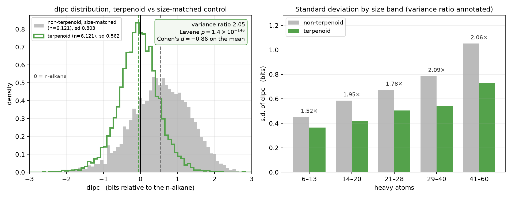

# Introduction

Molecular descriptor blocks are computed on every molecule in every model that uses them, so a
defective descriptor propagates silently and at scale. RDKit's `descList` contains 217 entries,
two of which — `Ipc` and `AvgIpc` — are information-theoretic indices over the characteristic
polynomial of the adjacency matrix [1,2].

This work asks whether those two indices measure what they are intended to measure, and whether
they are computed correctly. Both answers are negative. We identify the quantity `Ipc` actually
tracks, give a corrected algorithm for the underlying polynomial, propose a reformulation with
analytic references at both ends of its range, and apply it to natural product chemical space.

# Methods

**Exact characteristic polynomial.** The adjacency matrix of a molecular graph is integer, so
its characteristic polynomial has integer coefficients. We compute them exactly by running the
Faddeev–LeVerrier recursion modulo several small primes and reconstructing by the Chinese
remainder theorem, with primes chosen so that every modular matrix product remains exactly
representable in double precision (S2.1). Results were verified against exact rational
arithmetic.

**Information quantities.** With coefficient magnitudes $c$, let $S=\sum|c_i|$ and
$H = -\sum (c_i/S)\log_2(c_i/S)$. The standard descriptors are $\mathrm{Ipc}=S\cdot H$ and
$\mathrm{AvgIpc}=H$. We evaluate both by log-sum-exp so that $S$ is never formed explicitly.

**The dIpc index.** For an acyclic graph, $S$ equals the Hosoya index $Z$, the number of
matchings [1]. Among trees on $n$ vertices the path maximises $Z$, with $Z=F(n{+}1)$, the
Fibonacci number. We therefore define

$$\mathrm{dIpc}(G) \;=\; \log_2 Z(G) \;-\; \log_2 F(n{+}1),$$

which is zero for an unbranched chain, negative for branched acyclic graphs, and positive when
rings contribute additional matchings.

**Upper reference.** Since adding an edge cannot reduce the matching count, the maximum over
chemical graphs (connected, maximum degree $\le 4$) is attained on 4-regular graphs. These were
enumerated exhaustively with `geng` from *nauty* [5] and their matchings counted by subset
dynamic programming. Beyond $n=16$ we used local search over 2-opt edge swaps with an exact
objective, which yields lower bounds (S2.2); beyond $n=24$ the dynamic program exceeds memory
and we use a fitted law bracketed by an explicit construction below and a density ceiling above.

**Natural product data.** COCONUT 2022.01.01 structures with NPClassifier pathway labels [6,7,8].
Terpenoids are those with pathway exactly `Terpenoids` and one of five terpene superclasses;
compounds labelled `Alkaloids,Terpenoids` are excluded. Controls are single-pathway
non-terpenoids matched one-for-one on heavy-atom count, since the spread of dIpc grows with
molecular size and a range restriction would leave a confounding gradient. The largest fragment
is used throughout, as $Z$ is multiplicative over components.

# Results

## Ipc is dominated by the Hosoya index

The Bonchev–Trinajstić total information content $I = N\cdot H$ is defined for a population of
$N$ elements partitioned into classes by $H$ [2]. In $\mathrm{Ipc}=S\cdot H$, however, $H$ is an
entropy over the $n{+}1$ polynomial coefficients, bounded by $\log_2(n{+}1)$, while $S$ counts
matchings and grows as $\varphi^n$. The two factors refer to different populations.

Empirically the product is dominated by $S$. Across 400 molecules, $\log_2 S$ spans 32.3 bits
and $\log_2 H$ spans 2.24, with $R^2 = 0.9979$ between $\log_2\mathrm{Ipc}$ and $\log_2 S$
(Figure 1, right). As $\log_2 S$ correlates with heavy-atom count at $r=0.993$, `Ipc` is
approximately a measure of molecular size.

## The characteristic polynomial is computed incorrectly above 80 atoms

The Le Verrier–Faddeev–Frame recursion is sequential: coefficient $k$ is formed after $k$ matrix
products have grown the intermediates to the magnitude of the largest coefficient, then obtained
as a difference of quantities of that magnitude, with each coefficient entering the next matrix.

| $n$ | `AvgIpc`, RDKit | exact | coefficients in error by $>1\%$ |
|---|---|---|---|
| 60 | 3.2594 | 3.2594 | 0.0% |
| 80 | 3.46687 | 3.46686 | — |
| 100 | 3.6561 | 3.6278 | 19.6% |
| 120 | 1.4007 | 3.7593 | 23.0% |
| 250 | 1.1084 | 4.2886 | — |

`AvgIpc` is a Shannon entropy bounded by $\log_2(n{+}1)$ and cannot decrease as a chain is
extended; it begins decreasing near 110 atoms (Figure 1, left). Boundedness does not confer
safety: the quantity is computed from the same corrupted coefficients and degrades earlier and
less visibly than the unbounded `Ipc`. No overflow occurs — at $n=250$, $S=1.3\times10^{52}$
against a double-precision ceiling of $1.8\times10^{308}$ — so the returned values are finite.

Expanding the polynomial from its eigenvalues, with root factors multiplied in order of
increasing magnitude, keeps each partial product near the scale of the final coefficients.
Maximum relative error falls from $5.4\times10^{15}$ to $2.3\times10^{-15}$ at $n=200$, with an
eight-fold speed-up. The ordering is essential: unordered expansion still reaches
$4.8\times10^{4}$ relative error at $n=160$. The correction has been submitted upstream
(rdkit/rdkit#9657).

## dIpc removes the size dependence that other normalisations do not

| quantity | correlation with heavy-atom count |
|---|---|
| $\log_2 Z$ | $+0.993$ |
| $\log_2(Z)/n$ | $+0.409$ |
| $\mathrm{dIpc}$ | $+0.049$ |

Subtracting $\log_2 F(n{+}1)$ removes the size term exactly, where division by a power of $n$
removes it only approximately. The resulting index is signed and interpretable: zero for an
$n$-alkane, negative with branching, positive with ring fusion. Across 478 acyclic molecules no
value exceeded zero, consistent with the extremal property of the path.

## Z_max is exact to n = 16 and bounded to 0.022 bits beyond

| $n$ | $Z_{\max}$ | $\log_2 Z/n$ | basis |
|---|---|---|---|
| 12 | 2,921 | 0.95935 | exhaustive |
| 14 | 11,032 | 0.95924 | exhaustive |
| 16 | 42,439 | 0.96082 | exhaustive |
| 20 | 598,516 | 0.95957 | local search |
| 24 | 8,659,688 | 0.96025 | local search |
| 30 | $4.69\times10^{8}$ | — | fitted |
| 40 | $3.66\times10^{11}$ | — | fitted |
| 50 | $2.86\times10^{14}$ | — | fitted |

The fitted law $\log_2 Z_{\max}(n) = 0.96092\,n - 0.02313$ holds to $\pm0.022$ bits over
$n=12$–24. It is bounded below by an explicit construction — a chain of $K_{4,4}$ blocks, each
with one internal edge removed so that connector vertices remain within degree 4 — whose exact
$Z$ is obtained by transfer matrix at any size and which lies a constant 0.22 bits below the fit
up to $n=248$. It is bounded above by the $K_{4,4}$ density ceiling $0.96342\,n$. At $n=50$ the
two bounds differ by 0.25 bits.

The density is maximal at $K_{4,4}$ and the sequence shows period-8 structure: a connected
4-regular graph cannot attain the density of disjoint $K_{4,4}$ blocks, as joining two blocks
costs 0.0416 bits.

## Terpenoid topological variance is half that of other natural products

| | terpenoid | non-terpenoid | test |
|---|---|---|---|
| $n$ | 6,121 | 6,121 | — |
| mean heavy atoms | 30.72 | 30.72 | matched to $10^{-4}$ |
| mean dIpc | $-0.058$ | $+0.541$ | Cohen's $d = -0.86$ |
| s.d. | 0.562 | 0.803 | Levene $p = 1.4\times10^{-146}$ |
| variance ratio | — | 2.045 | Fligner $p = 2.8\times10^{-146}$ |

Terpenoid skeletons occupy approximately half the topological variance of size-matched natural
products and lie on the branched side of the chain reference, while other pathways lie on the
ring-fused side. The restriction is not a size artefact: variance ratios are 1.52, 1.95, 1.78,
2.09 and 2.06 across bands of 6–13, 14–20, 21–28, 29–40 and 41–60 heavy atoms, all with
$p<0.01$.

Both effects are large. The separation in means corresponds to Cohen's $d = -0.86$, and the
variance ratio of 2.045 is estimated on 6,121 matched pairs. Terpenoid identity is therefore
predictive of position on this axis independently of molecular size.

A weaker secondary trend exists within terpenoids: dIpc decreases by $0.046\pm0.005$ bits per
isoprene unit ($r=-0.110$, $p=4.9\times10^{-18}$), explaining about 1% of the variance, and
class means are not monotone (S3.3).

# Discussion

`Ipc` should be removed from descriptor blocks. It is approximately a function of molecular
size, which is already represented by numerous other descriptors, and it is computed from a
polynomial that is unreliable above 80 atoms. Models trained on molecules below about 60 atoms
are unaffected by the correction, since old and corrected values agree to $10^{-15}$ in that
range; above it, feature distributions change and should be re-examined rather than simply
recomputed.

`AvgIpc` should be retained once the underlying polynomial is corrected, and `dIpc` added
alongside it. The cost of dIpc is approximately 10 ms per molecule at $n=50$ using the exact
path. It contributes no additional information to a model already provided with $\log_2 Z$ and
$n$ and sufficient flexibility to combine them (partial $r=+0.0095$); its value lies in
interpretability, in extrapolation beyond the training size range, and in settings where the
model cannot learn the interaction. For a feature matrix, $\log_2 Z$ and $n$ are better supplied
as separate columns than pre-combined: division by $n^{1/3}$, $n^{2/3}$ or $n$ adds nothing once
both are present (partial $r$ of $-0.087$, $-0.092$, $-0.096$).

Terpenoid biosynthesis leaves a measurable signature in graph topology. Assembly from a single
branched C5 unit confines terpenoid skeletons to half the topological variance of size-matched
natural products and displaces them to the branched side of the chain reference, while pathways
not built this way are displaced to the ring-fused side. The effect is large ($d=-0.86$),
uniform across the full size range examined, and robust to exact size matching, which is the
principal confounder for any index of this kind. dIpc is consequently usable as a
size-independent descriptor of biosynthetic class, not only as a repair of `Ipc`.

# Limitations

The isoprene trend within terpenoids explains approximately 1% of the variance and class means
are not monotone; it is reported for completeness and no weight is placed on it. Terpenoid
assignment derives from a neural classifier rather than curated biosynthetic provenance, and
meroterpenoids and steroids were excluded as ambiguous without sensitivity testing. COCONUT
2022.01.01 is a literature aggregation; no deduplication was applied beyond fragment selection,
so related scaffolds may be over-represented in both groups equally.

$Z_{\max}$ values for $n=17$–24 are lower bounds rather than proven maxima, with a validated
worst-case shortfall of 0.48%; the fitted law is correspondingly a slight underestimate. The
optimality of $K_{4,4}$ is confirmed exhaustively at $n=8$ and $n=16$ but its asymptotic form is
taken from the literature.

dIpc contributes no additional information to a model already supplied with $\log_2 Z$ and $n$
and able to combine them nonlinearly; its value is interpretability and extrapolation, not
predictive gain. Its components are established prior results [1,4]; a literature search over
OpenAlex returned no previous definition of $\log Z - \log F(n{+}1)$ as a descriptor, but this
is not an exhaustive novelty search.

**Retraction.** A preliminary analysis of 43 curated terpenes reported no difference in mean
dIpc between terpenes and size-matched molecules ($p=0.106$). That conclusion was incorrect and
is retracted: it reflected insufficient power, not absence of effect. The present analysis on
6,121 matched pairs finds a large difference ($d=-0.86$). The same analysis also overestimated
the isoprene slope by a factor of 2.5. Its variance-ratio estimate, 2.120, was accurate (S3.3).

# References

1. H. Hosoya. Topological Index. A Newly Proposed Quantity Characterizing the Topological Nature
   of Structural Isomers of Saturated Hydrocarbons. *Bull. Chem. Soc. Jpn.* **44**, 2332 (1971).
   [10.1246/bcsj.44.2332](https://doi.org/10.1246/bcsj.44.2332)
2. D. Bonchev, N. Trinajstić. Information theory, distance matrix, and molecular branching.
   *J. Chem. Phys.* **67**, 4517 (1977). [10.1063/1.434593](https://doi.org/10.1063/1.434593)
3. S. H. Bertz. Branching in graphs and molecules. *Discrete Appl. Math.* **19**, 65 (1988).
   [10.1016/0166-218X(88)90006-6](https://doi.org/10.1016/0166-218X(88)90006-6)
4. H. Hosoya. Chemical meaning of octane number analyzed by topological indices (2002).
5. B. D. McKay, A. Piperno. Practical graph isomorphism, II. *J. Symb. Comput.* **60**, 94 (2014).
   [10.1016/j.jsc.2013.09.003](https://doi.org/10.1016/j.jsc.2013.09.003)
6. M. Sorokina, P. Merseburger, K. Rajan, M. A. Yirik, C. Steinbeck. COCONUT online: Collection
   of Open Natural Products database. *J. Cheminform.* **13**, 2 (2021).
   [10.1186/s13321-020-00478-9](https://doi.org/10.1186/s13321-020-00478-9)
7. H. W. Kim *et al.* NPClassifier: A Deep Neural Network-Based Structural Classification Tool
   for Natural Products. *J. Nat. Prod.* **84**, 2795 (2021).
   [10.1021/acs.jnatprod.1c00399](https://doi.org/10.1021/acs.jnatprod.1c00399)
8. NPClassifier predictions of COCONUT compounds.
   [10.5281/zenodo.10629838](https://doi.org/10.5281/zenodo.10629838)

\newpage

# Supplementary information

## S1. Data

| source | count | range | use |
|---|---|---|---|
| boiling-point set | 1,000 molecules | 2–63 heavy atoms | general chemical space |
| — variance decomposition subset | 400 | 3–49 | Figure 1 |
| COCONUT 2022.01.01, NPClassifier-labelled | 407,029 | — | terpenoid pool |
| — terpenoids sampled, 5 superclasses | 6,121 | 6–60 | Figure 3 |
| — size-matched controls | 6,121 | 6–60 | Figure 3 |
| curated terpenes (preliminary) | 43 of 46 | 10–30 carbons | S3.3 |
| connected 4-regular graphs | 8,037,418 at $n{=}16$ | $n=5$–16 | $Z_{\max}$ |

Terpenoid superclass counts in COCONUT: diterpenoids 23,082; triterpenoids 22,280;
sesquiterpenoids 20,418; steroids 16,768; monoterpenoids 6,207; meroterpenoids 3,607;
sesterterpenoids 937; carotenoids 953.

Each curated entry was checked against the carbon count its class requires. Three of 46 failed
this check and were corrected before use.

## S2. Algorithms

### S2.1 Modular characteristic polynomial

Primes are selected such that $n(p-1)^2 < 2^{53}$, which keeps each modular matrix product
exactly representable in double precision and allows the inner loop to use a floating-point
matrix multiply rather than arbitrary-precision integer arithmetic. The number of primes is set
from a Hadamard bound on the coefficient magnitudes. Output was verified identical to
Faddeev–LeVerrier over exact rationals on random sparse symmetric graphs up to $n=30$.

### S2.2 Local search over 4-regular graphs

Initialisation is a circulant graph $C_n(1,2)$, which is 4-regular and connected. Each step
proposes a 2-opt edge swap: edges $(a,b)$ and $(c,d)$ are deleted and $(a,c)$, $(b,d)$ inserted,
leaving all vertex degrees unchanged. Swaps that disconnect the graph are rejected; the exact
matching count is recomputed and the swap accepted when it does not decrease. Multiple restarts
from independent random states are used. Every reported value is the exact $Z$ of a realised
graph and is therefore a lower bound on $Z_{\max}$.

Validation against exhaustively known maxima: recovered at $n=10$, 12, 13 and 15; at $n=14$ the
best of 24 restarts fell 0.48% short.

### S2.3 Block-chain transfer matrix

For blocks joined in a path by single edges, with per-block counts $N$, $N_l$, $N_r$, $N_{lr}$
(total matchings, and those leaving the left, right, or both connectors unmatched),

$$u_{i+1} = u_i N_{lr} + (u_i+m_i)N_r, \qquad m_{i+1} = u_i(N_l-N_{lr}) + (u_i+m_i)(N-N_r),$$

where $u$ and $m$ count configurations with the right connector unmatched and matched. This is
exact and linear in the number of blocks. An initial version used intact $K_{4,4}$ blocks, which
raises connector degree to 5 and violates the valence constraint; one internal edge is therefore
removed per block.

## S3. Supplementary results

### S3.1 Timings

| step | $n$ | wall time |
|---|---|---|
| exhaustive enumeration and exact $Z$ | 10 | 0.03 s |
| | 12 | 0.07 s |
| | 14 | 4.3 s |
| | 15 | 52 s |
| | 16 | 1,140 s |
| local search, 2,000 moves | 20 | 2.1 s |
| | 24 | 42 s |
| block-chain transfer matrix | $\le 248$ | 0.17 s |

Exhaustive enumeration scales at roughly 10–20× per added atom; $n=17$ would require
approximately six hours and $n=18$ approximately three days.

### S3.2 Exhaustive $Z_{\max}$

| $n$ | 5 | 6 | 7 | 8 | 9 | 10 | 11 | 12 | 13 | 14 | 15 | 16 |
|---|---|---|---|---|---|---|---|---|---|---|---|---|
| $Z_{\max}$ | 26 | 51 | 100 | 209 | 388 | 780 | 1482 | 2921 | 5600 | 11032 | 21482 | 42439 |

Generated graph counts match OEIS A006820. The maximum at $n=8$ is $K_{4,4}$. At $n=10$ the
maximum over all connected graphs of maximum degree $\le4$ (89,402 graphs) equals the maximum
over 4-regular graphs, consistent with edge monotonicity.

### S3.3 Retracted preliminary analysis

A preliminary analysis of 43 curated terpenes preceded the COCONUT study. Its conclusions on
mean difference and isoprene slope are retracted; its variance-ratio estimate was accurate.

| quantity | curated, $n=43$ | COCONUT, $n=6{,}121$ | status |
|---|---|---|---|
| variance ratio | 2.120, $p=0.038$ | 2.045, $p=1.4\times10^{-146}$ | confirmed, within 4% |
| mean difference | $-0.141$, $p=0.106$ | $-0.599$, $d=-0.86$ | **retracted** |
| isoprene slope | $-0.118$/unit, $r=-0.351$ | $-0.046$/unit, $r=-0.110$ | **retracted** |

Terpenoid class means on COCONUT: monoterpenoid $-0.030$ ($n=509$), sesquiterpenoid $+0.031$
($n=1{,}680$), diterpenoid $-0.055$ ($n=1{,}898$), sesterterpenoid $-0.108$ ($n=200$),
triterpenoid $-0.146$ ($n=1{,}834$).

### S3.4 Normalisation exponents

Partial correlation with the boiling-point residual for $\log_2(Z)/n^k$, as the regression basis
is enriched:

| basis | $k=1/3$ | $k=2/3$ | $k=1$ |
|---|---|---|---|
| size terms only, linear | $+0.444$ | $+0.426$ | $+0.360$ |
| size $+\log_2 Z$ | $+0.247$ | $+0.220$ | $+0.060$ |
| size $+\log_2 Z+$ nonlinear $n$ | $-0.087$ | $-0.092$ | $-0.096$ |

## S4. Software and reproducibility

Code, data and figures: **github.com/guillaume-osmo/kumomlx**

| component | path |
|---|---|
| exact characteristic polynomial, dIpc, $Z_{\max}$ | `src/kumomlx/ipc.py` |
| derivation and measurements | `DESCRIPTORS.md` |
| upstream patch and Eigen C++ implementation | `rdkit-fix/` |
| $Z_{\max}$ enumeration | `rdkit-fix/zmax/` |
| COCONUT analysis | `paper/coconut.py`, `paper/coconut_stats.py` |
| figures | `paper/fig_*.py` |

RDKit 2025.09.4; nauty 2.9.3, invoked as `geng -c -d4 -D4 n`.
